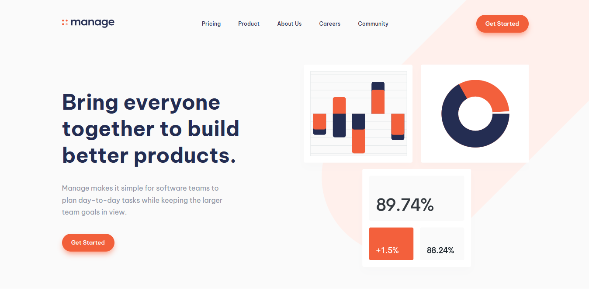

# Frontend Mentor - Manage landing page solution

## Hi there, it TeeDav!😀
This is my solution to the [Manage landing page challenge on Frontend Mentor](https://www.frontendmentor.io/challenges/manage-landing-page-SLXqC6P5). Live Site URL: [Add live site URL here](https://your-live-site-url.com)

### Screenshot

### What I learned

CSS variables,
Units/Measurements,
Media queries,
flex box and grids

### Author

- Twitter - [@taligwo](https://www.twitter.com/teedav)
- LinkedIn - [Add your name here](https://www.your-site.com)

